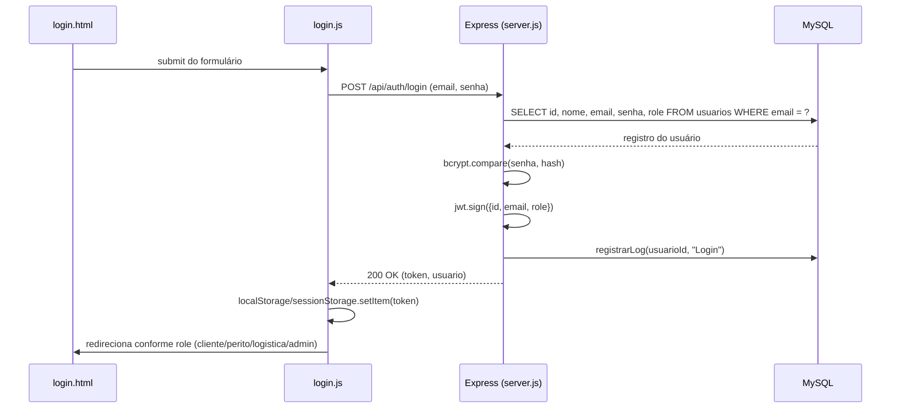
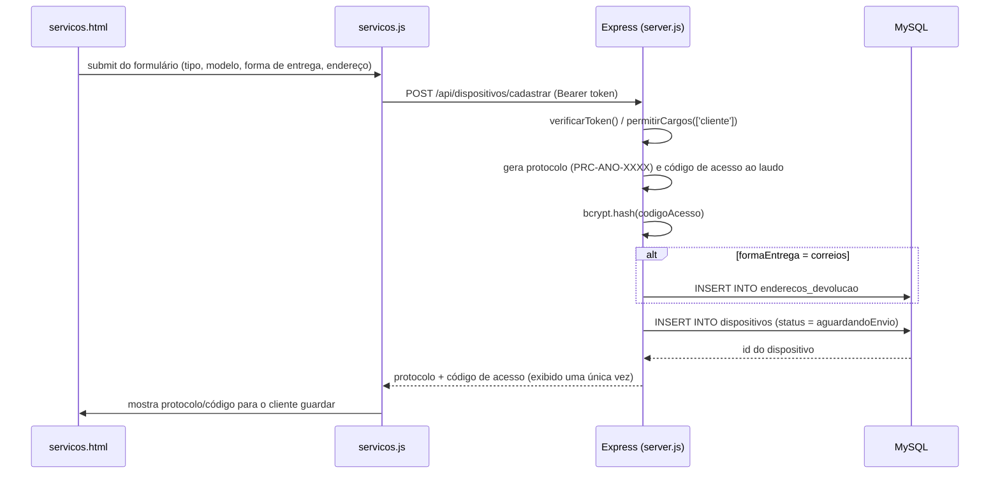
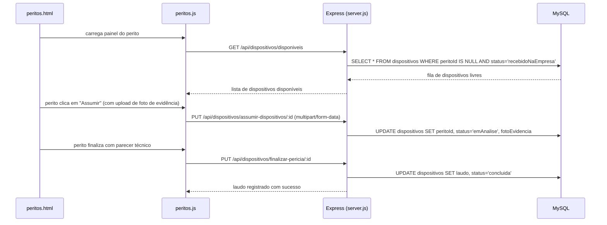
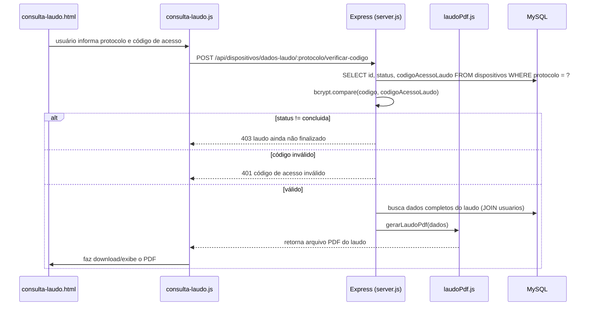
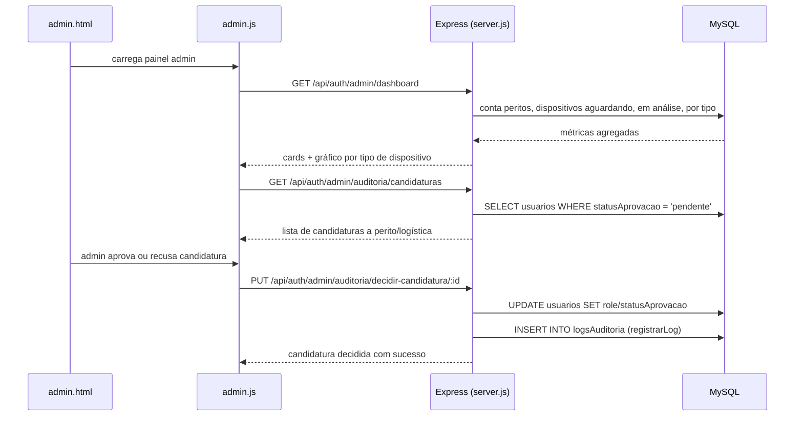
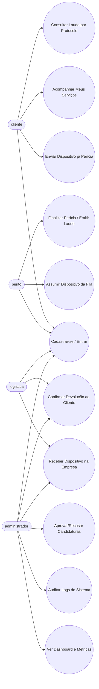
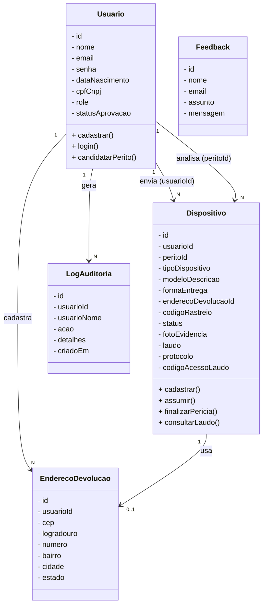
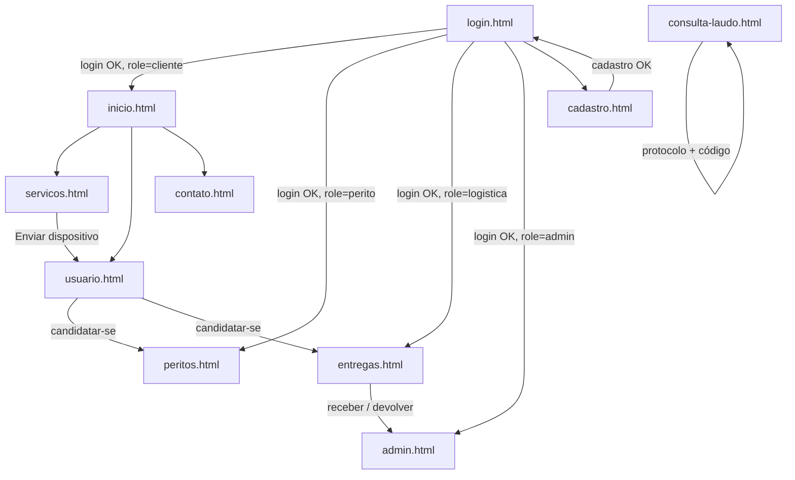

# Pericia

Sistema web (projeto de estudo) de gestão de perícias forenses em dispositivos eletrônicos, com frontend em HTML/CSS/JS puro e backend em Node.js/Express + MySQL. Cobre o fluxo completo entre cliente, perito, logística e administrador: cadastro/login com controle de cargos (roles), envio de dispositivo para perícia (Correios ou balcão), fila de atendimento dos peritos, emissão de laudo em PDF, consulta pública de laudo por protocolo/código, painel administrativo com dashboard, auditoria de logs e aprovação de candidaturas a perito/logística.

## Diagrama de Sequência — **Login**


## Diagrama de Sequência — **Cadastro de Dispositivo para Perícia**


## Diagrama de Sequência — **Fila do Perito e Finalização da Perícia**


## Diagrama de Sequência — **Consulta Pública de Laudo (protocolo + código)**


## Diagrama de Sequência — **Painel Administrativo (dashboard e auditoria)**


# Caso de Uso



## Diagrama de Classes (conceitual)



## Fluxo de Navegação (telas do frontend)



# Rotas da API (Backend)

Prefixo base: `/api`

### Autenticação e Usuários — `/api/auth`
- **POST /login** — Autentica usuário (bcrypt + JWT) e registra log de auditoria.
- **POST /cadastro** — Cria um novo usuário (hash de senha com bcrypt).
- **GET /usuario/perfil** — Retorna dados do usuário logado (nome, e-mail, role, status de aprovação).
- **DELETE /usuario/excluir-conta** — Exclui a conta do usuário logado (cascata em `dispositivos`).
- **PUT /candidatar-perito** — Cliente se candidata a `perito` ou `logistica` (status fica `pendente`).
- **GET /admin/dashboard** — Métricas para o painel admin (peritos, fila, em análise, por tipo).
- **GET /admin/dispositivos** — Lista todos os dispositivos com filtro opcional `?status=`.
- **PUT /admin/receber-dispositivo/:id** — Marca dispositivo como recebido na empresa.
- **GET /admin/auditoria/logs** — Lista paginada de logs (`?tipo=&busca=&pagina=&limite=`).
- **GET /admin/auditoria/candidaturas** — Lista candidaturas pendentes a perito/logística.
- **PUT /admin/auditoria/decidir-candidatura/:id** — Aprova ou recusa uma candidatura.

### Dispositivos / Perícias — `/api/dispositivos`
- **POST /cadastrar** — Cliente registra um dispositivo para perícia (gera protocolo e código de acesso ao laudo).
- **GET /meus-servicos** — Histórico de dispositivos enviados pelo cliente logado.
- **PUT /atualizar-rastreio/:id** — Atualiza o código de rastreamento dos Correios.
- **GET /disponiveis** — Fila de dispositivos livres para peritos assumirem.
- **PUT /assumir-dispositivos/:id** — Perito assume um dispositivo (upload de foto de evidência).
- **GET /meus-casos** — Lista os dispositivos que o perito logado está analisando.
- **PUT /finalizar-pericia/:id** — Perito finaliza a análise e grava o parecer técnico (laudo).
- **GET /dados-laudo/:id** — Dados do laudo em JSON (cliente dono, perito responsável ou admin).
- **GET /dados-laudo/:id/pdf** — Mesmo laudo, já formatado em PDF (autenticado).
- **POST /dados-laudo/:protocolo/verificar-codigo** — Consulta pública do laudo por protocolo + código de acesso (com rate limit) — retorna o PDF.
- **PUT /logistica/receber/:id** — Logística confirma entrada física do dispositivo na empresa.
- **PUT /logistica/devolver/:id** — Logística confirma devolução ao cliente.
- **PUT /logistica/reverter-entrega/:id** — Reverte uma devolução confirmada por engano.
- **GET /logistica/aguardando-recebimento** — Lista dispositivos aguardando chegada na empresa.
- **GET /logistica/pendentes-entrega** — Lista dispositivos com perícia concluída aguardando devolução.
- **GET /logistica/entregues** — Lista dispositivos já devolvidos ao cliente.

### Feedback / Contato — `/api/feedbacks`
- **POST /enviar** — Envia mensagem de contato (nome, e-mail, assunto, mensagem).

### Arquivos estáticos
- **GET /uploads/\*** — Serve as fotos de evidência enviadas pelos peritos (`express.static`).

# Conceitos e Tecnologias

- **Frontend**: HTML5 + CSS3 (sem framework) + JavaScript puro (Vanilla JS, um arquivo por tela).
- **Backend**: Node.js + Express 5 (ESM/`type: module`), organizado em `app.js` (configuração), `server.js` (bootstrap) e `routes/` (usuários, dispositivos, feedbacks).
- **Banco de Dados**: MySQL (via `mysql2/promise`), acessado por uma função utilitária `executarQuery()` que abre e fecha conexão a cada chamada.
- **Autenticação**: senha com hash `bcrypt`; sessão via **JWT** (`jsonwebtoken`), validado no middleware `verificarToken`; controle de acesso por cargo (`role`) no middleware `permitirCargos`.
- **Upload de arquivos**: `multer`, usado para a foto de evidência anexada pelo perito ao assumir um dispositivo.
- **Geração de PDF**: `pdfkit`, usado para montar o laudo pericial em PDF (`laudoPdf.js`), tanto na rota autenticada quanto na consulta pública.
- **Segurança de rotas sensíveis**: `express-rate-limit` na rota pública de verificação de código de acesso ao laudo (5 tentativas / 15 min por IP).
- **Auditoria**: toda ação relevante (login, aprovação/recusa de candidatura) é registrada na tabela `logsAuditoria` via `registrarLog()`.
- **CORS**: `cors`, liberando o consumo da API pelo frontend.

# Funções MySQL

- CREATE — Cria as tabelas do banco (`usuarios`, `dispositivos`, `enderecos_devolucao`, `logsAuditoria`, `servico`, `feedback`).
- INSERT — Cria registros (usuários, dispositivos, endereços de devolução, logs, feedbacks).
- SELECT — Consulta e filtra dados (fila de peritos, histórico do cliente, dashboard, auditoria com paginação).
- UPDATE — Atualiza registros (status do dispositivo em cada etapa do fluxo, role/statusAprovacao do usuário, laudo, código de rastreio).
- DELETE — Exclusão de conta do usuário (`DELETE FROM usuarios`), com cascata para `dispositivos`.
- DROP — Usado apenas nos scripts de criação inicial do banco (`cliente.sql`), não em tempo de execução da aplicação.

# Conceitos MySQL usados no projeto

- **Banco de Dados**: `pericia` (local) / `railway` (produção), criado pelos scripts em `Backend/sql/`.
- **Tabelas**: `usuarios`, `dispositivos`, `enderecos_devolucao`, `logsAuditoria`, `servico`, `feedback`.
- **Relacionamentos (Foreign Keys)**: `dispositivos.usuarioId` e `dispositivos.peritoId` → `usuarios.id`; `dispositivos.enderecoDevolucaoId` → `enderecos_devolucao.id`; `logsAuditoria.usuarioId` → `usuarios.id` (com `ON DELETE CASCADE`/`SET NULL` conforme o caso).
- **Enums de controle de fluxo**: `usuarios.role` (`cliente`, `perito`, `logistica`, `admin`), `usuarios.statusAprovacao` (`nenhum`, `pendente`, `aprovado`, `recusado`), `dispositivos.status` (`aguardandoEnvio` → `recebidoNaEmpresa` → `emAnalise` → `concluida` → `devolvida`).
- **Segurança de dados**: senha do usuário e código de acesso ao laudo (`codigoAcessoLaudo`) armazenados com hash `bcrypt`, nunca em texto puro.

# Bibliotecas / Dependências (Node.js)

Projeto full-stack, dividido em dois `package.json` (`frontend` e `backend`):

**Backend**
- **express** — servidor HTTP e roteamento das APIs.
- **mysql2** — driver MySQL com suporte a `async/await` (`mysql2/promise`).
- **bcrypt** — hash de senhas e do código de acesso ao laudo.
- **jsonwebtoken** — geração e validação do token de sessão (JWT).
- **cors** — libera requisições do frontend para a API.
- **multer** — upload da foto de evidência do perito.
- **pdfkit** — geração do laudo pericial em PDF.
- **express-rate-limit** — limita tentativas na rota pública de consulta de laudo.

**Frontend**
- **express** — usado apenas para servir os arquivos estáticos do frontend.

## Dependências de desenvolvimento

- **VSCode**: IDE utilizada no desenvolvimento.
- **Mermaid**: linguagem para os diagramas deste documento.
- **MySQL**: SGBD utilizado localmente e em produção.
- **Railway**: plataforma de hospedagem do backend e do banco de dados MySQL.

## Build / Como rodar localmente

**Diretório raiz do backend:**
```
cd pericia/backend
```

**Instalar dependências:**
```
npm install
```

**Configurar variáveis de ambiente:** crie um arquivo `backend/dev.env` com, no mínimo:
```
DB_HOST=127.0.0.1
DB_PORT=3306
DB_USER=root
DB_PASSWORD=sua_senha_mysql
DB_NAME=pericia
```

**Criar o banco de dados:** execute os scripts na pasta `Backend/sql/` na sua instância MySQL local, na ordem:
```
mysql -u root -p < sql/create-db-template.sql
mysql -u root -p pericia < sql/cliente.sql
mysql -u root -p pericia < sql/dispositivo.sql
mysql -u root -p pericia < sql/logAuditoria.sql
mysql -u root -p pericia < sql/servico.sql
```

**Subir o servidor (modo desenvolvimento, com `--watch`):**
```
npm start
```

O servidor sobe em `http://localhost:3000` por padrão (ou na porta definida em `process.env.PORT`).

**Frontend:** as páginas em `frontend/html/` são estáticas e consomem a API acima — podem ser abertas diretamente no navegador ou servidas por qualquer servidor estático (inclusive `npm start` dentro de `frontend/`, que também usa Express).

## Deploy (Railway)

O backend e o banco de dados estão hospedados no **Railway**:

- O **MySQL** roda como um plugin/serviço próprio do Railway, acessado publicamente através de um proxy (`*.proxy.rlwy.net`) — as credenciais de conexão (host, porta, usuário, senha e nome do banco) ficam nas variáveis de ambiente do serviço, seguindo o mesmo formato de `backend/prd.env` (host, porta, usuário, senha e database), configuradas diretamente no painel do Railway e **não** versionadas no repositório.
- O **backend Node.js/Express** é implantado como outro serviço do Railway a partir do diretório `backend/`, usando o `npm start` definido em `package.json` como comando de start.
- A porta do servidor é lida de `process.env.PORT` (`server.js`), que o Railway injeta automaticamente — não é necessário fixar a porta manualmente.
- As variáveis `DB_HOST`, `DB_PORT`, `DB_USER`, `DB_PASSWORD` e `DB_NAME` do serviço de backend são configuradas no painel do Railway apontando para o serviço de MySQL do próprio projeto (o Railway permite referenciar as variáveis de um serviço dentro de outro).
- Os scripts em `Backend/sql/` são executados uma vez contra o banco do Railway (via cliente MySQL local apontando para o host/porta público do proxy) para criar o schema em produção; os `DROP TABLE` presentes em alguns scripts de criação **não devem** ser reexecutados em produção, pois apagariam dados já existentes (uso recomendado: `ALTER TABLE` para mudanças incrementais, conforme documentado nos próprios arquivos `.sql`).
- Arquivos `*.env` ficam fora do controle de versão (`.gitignore`); cada ambiente (`dev.env` local e as variáveis do serviço em produção) mantém suas próprias credenciais.